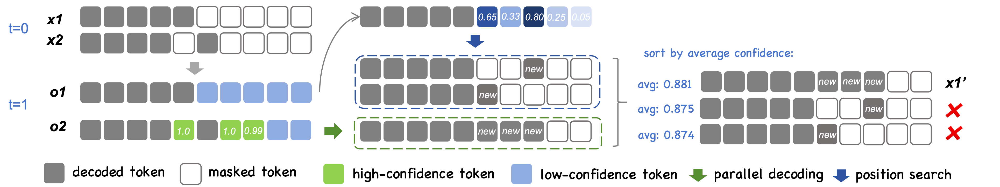
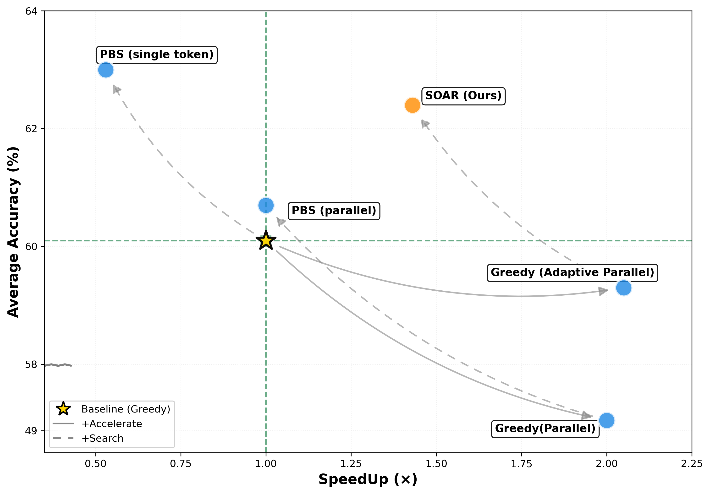

# SOAR: Confidence-Switched Position Beam Search for Diffusion Language Models

[](https://arxiv.org/abs/2602.10953)

<p align="center">
  &nbsp;&nbsp;&nbsp;
  &nbsp;&nbsp;&nbsp;
  &nbsp;&nbsp;&nbsp;
  &nbsp;&nbsp;&nbsp;
  
</p>

**[Mingyu Cao](https://scholar.google.com/citations?user=nq7uHwQAAAAJ&hl=en)** · 
**[Alvaro H.C. Correia](https://scholar.google.com/citations?hl=en&user=E9h9QKEAAAAJ)** · 
**[Christos Louizos](https://scholar.google.com/citations?hl=en&user=xrSUChoAAAAJ&view_op=list_works&sortby=pubdate)** · 
**[Shiwei Liu](https://shiweiliuiiiiiii.github.io/)** · 
**[Lu Yin](https://luuyin.com/)**

University of Surrey · Qualcomm AI Research · ELLIS Institute Tübingen · Max Planck Institute for Intelligent Systems · Tübingen AI Center

📧 **Contact**: The code can be contacted at [m.cao@surrey.ac.uk](mailto:m.cao@surrey.ac.uk)


## 📖 Overview

<div align="center">
  
</div>

SOAR is a confidence-switched position beam search decoding strategy for diffusion language models. The core idea is:

When there are high-confidence tokens in the sequence, SOAR selects parallel decoding for these tokens; otherwise, it employs position beam search to expand the search space.

---

## 🎯 Main Results

<p align="center">
  
</p>

SOAR achieves improved decoding quality without sacrificing decoding speed, averaging results across GSM8K, MBPP, and HumanEval.

---

## 🔧 Installation

```bash
git clone https://github.com/duterscmy/SOAR.git
cd SOAR
pip install transformers==4.46.2 torch==2.5.1 accelerate==1.12.0
```

## 📊 Evaluation

We evaluate SOAR using the [lm-evaluation-harness](https://github.com/EleutherAI/lm-evaluation-harness) from EleutherAI.

### For LLaDA-8B-Base
```bash
cd eval_llada8b
bash eval_soar_llada.sh
```

### For Dream-7B-Base:
```bash
cd eval_dream7b
bash eval_soar_dream.sh
```

## 📝 Citation
If you use SOAR in your research, please cite:

```
@misc{cao2026searchaccelerateconfidenceswitchedposition,
    title={Search or Accelerate: Confidence-Switched Position Beam Search for Diffusion Language Models}, 
    author={Mingyu Cao and Alvaro Correia and Christos Louizos and Shiwei Liu and Lu Yin},
    year={2026},
    eprint={2602.10953},
    archivePrefix={arXiv},
    primaryClass={cs.CL},
    url={https://arxiv.org/abs/2602.10953}, 
}
```


## Acknowledgments
This implementation is based on the [LLaDA](https://github.com/ML-GSAI/LLaDA) and [Dream](https://github.com/DreamLM/Dream) repositories. We thank the teams for open-sourcing their models and code.